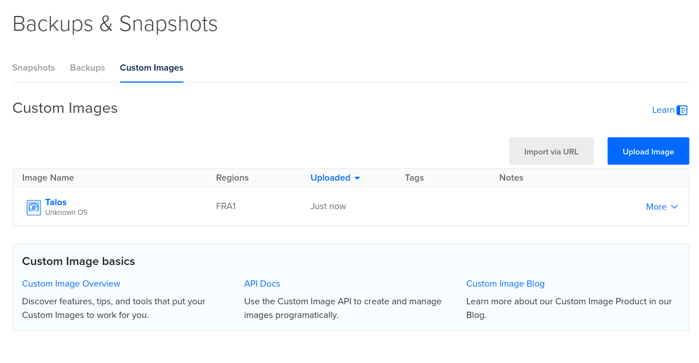

## Local setup

Refer to [talos docs](https://docs.siderolabs.com) for more information

Install `talosctl` to spin up test cluster in your local machine

```fish
talosctl cluster create --workers 3
```

## Production setup in Digital Ocean

Digital Ocean only supports this format

- `https://factory.talos.dev/image/..../metal-amd64.qcow2`

Need to click `Import via URL` and paste link



then you can create master/worker nodes from the image

talos don't have ssh and stuff like that, need to configure everything via `talosctl`

for more information refer to [talos docs](https://docs.siderolabs.com/talos/v1.11/getting-started/getting-started)

```fish
set CONTROL_PLANE_IP <your-control-plane-ip>
set WORKER_IP ("<worker-ip-1>" "<worker-ip-2>" "<worker-ip-3>" ...)
```
